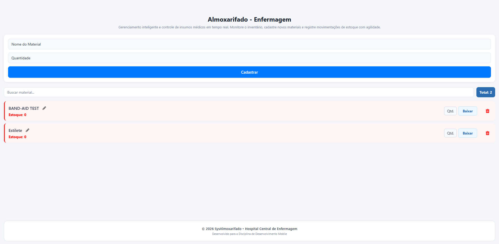
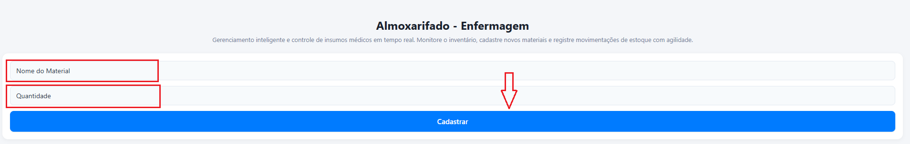
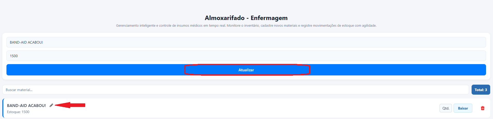
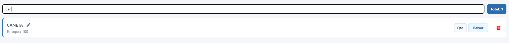
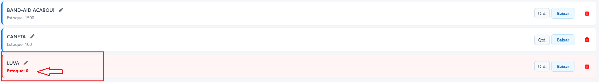
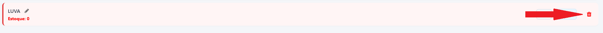

# SysAlmoxarifado - Controle de Estoque (Enfermagem)

Este projeto foi desenvolvido para a disciplina de Desenvolvimento Mobile com o objetivo de modernizar e digitalizar o controle de insumos médicos do almoxarifado de enfermagem. 

O sistema substitui os antigos rascunhos de papel e planilhas manuais por um aplicativo mobile integrado a uma API em tempo real.

---

## 🛠️ Tecnologias e Bibliotecas Utilizadas

- **React Native** (Interface nativa e responsiva)
- **Expo** (Ambiente de desenvolvimento e build)
- **MockAPI** (Persistência de dados através de serviços REST)
- **Jest & Testing Library** (Estrutura de testes automatizados e assíncronos)
- **Expo Vector Icons (FontAwesome)** (Identidade visual e ícones clínicos)

---

## 🛠️ Evolução do Projeto & Funcionalidades

###  Sprint 1: Estrutura Base & CRUD de Materiais
- **Integração com API REST:** Conexão assíncrona com o servidor *MockAPI*  para persistência dos dados de insumos médicos.
- **Operações de CRUD:** Listagem dinâmica de materiais cadastrados e formulário funcional para adição de novos insumos.
- **Interface Base:** Estrutura visual desenvolvida em React Native focando no almoxarifado de enfermagem.

###  Sprint 2: Movimentação de Estoque & Validações
- **Operação de Baixa Automática:** Implementação do campo de quantidade e do botão "Baixar" para deduzir itens do estoque de forma rápida.
- **Validação de Regras de Negócio:** Integração de funções puras e isoladas para validar se a quantidade a ser retirada está disponível, bloqueando valores negativos ou acima do saldo atual.
- **Aviso de Estoque Zerado:** Emissão de alertas visuais (`Estoque: 0` em vermelho e negrito) e avisos em tempo real caso o insumo acabe por completo no almoxarifado.

###  Sprint 3: Filtros, Alertas Críticos & Resiliência
- **Filtro de Pesquisa em Tempo Real:** Campo de busca dinâmico para filtragem instantânea de materiais por nome à medida que o usuário digita (`testID="input-busca"`).
- **Indicador de Estoque Crítico:** Alerta visual que altera o fundo e a borda do cartão do material para tons de vermelho claro quando a quantidade em estoque é menor que 10 unidades (`accessibilityLabel="estoque-critico"`).
- **Dashboard com Totalizador:** Contador fixado no topo da listagem que exibe em tempo real o número exato de itens exibidos com base no filtro aplicado (`testID="total-itens"`).
- **Resiliência e Tratamento de Erros:** Blocos `try/catch` robustos em todas as operações HTTP (`GET`, `POST`, `PUT`, `DELETE`), exibindo mensagens amigáveis na tela caso ocorra instabilidade ou queda na conexão com a rede.

## 🎨 Identidade Visual e Rodapé

O sistema conta com um acabamento visual no rodapé para melhor aproveitamento do espaço em tela e identificação institucional:
- **Design Clean:** Alinhamento centralizado com separadores sutis para visualização profissional tanto em Web quanto Mobile.
- **Hierarquia de Cores:** Uso de cinza escuro (`#2d3748`) para destaque institucional e cinza médio (`#718096`) para informações secundárias de desenvolvimento.

## 🔧 Como Executar o Projeto

Siga os passos abaixo para clonar o repositório, instalar as dependências e executar o projeto em ambiente de desenvolvimento:

1. **Clone o repositório:**
```
   git clone [https://github.com/seu-usuario/seu-repositorio.git](https://github.com/seu-usuario/seu-repositorio.git)
   cd seu-repositorio
```

2. **Instale as dependências do projeto:**
```
npm install
```

3. **Rode a aplicação:**
```
npm start
```
* Ou rode por: 
```
npx expo start
```

4. **Acesse a aplicação:**
* **No Navegador (Web):**  Pressione a tecla *"w"* no terminal para abrir o projeto diretamente no seu navegador.
* **No Dispositivo Móvel:** Baixe o aplicativo Expo Go (disponível para Android e iOS) e leia o QR Code gerado no terminal.

---
---

## 📱 Guia de Funcionamento do Sistema

Esta seção apresenta o fluxo de uso da aplicação, partindo de uma visão macro do painel e detalhando cada operação essencial de gerenciamento de insumos.

### 🔍 1. Visão Geral do Painel (Dashboard)
A tela principal foi projetada para centralizar o controle do almoxarifado em uma única interface responsiva. No topo, encontra-se o formulário de entrada; ao centro, a barra de pesquisa inteligente com o indicador do total de itens; e abaixo, a listagem dinâmica que sinaliza visualmente a saúde do estoque.



---

### 📥 2. Adicionar Novo Item (Cadastro)
O fluxo de entrada de novos insumos médicos funciona da seguinte forma:
1. O operador insere o nome no campo **"Nome do Material"**.
2. Digita o saldo inicial no campo **"Quantidade"**.
3. Ao clicar no botão **"Cadastrar"**, o aplicativo valida os dados, realiza uma requisição `POST` para o servidor MockAPI e insere o item no topo da listagem de forma síncrona.



---

### ✏️ 3. Editar/Atualizar Item Existente
Caso seja necessário corrigir o nome ou o saldo de um material já cadastrado:
1. O operador localiza o item na lista e clica no ícone de **Lápis Cinza** ao lado do nome do material.
2. O sistema carrega os dados atuais de volta para os campos do formulário no topo.
3. O botão principal muda dinamicamente sua interface: altera a cor para verde e o texto para **"Atualizar"**, dando um feedback visual claro de que o sistema está em modo de edição.
4. Após realizar as alterações, basta clicar em **"Atualizar"** para disparar uma requisição `PUT` e salvar os novos dados na API.



---

### 🔎 4. Busca e Filtragem de Itens
Para localizar insumos de forma rápida em momentos de alta demanda na enfermagem:
- O usuário digita o termo desejado no campo **"Buscar material..."**.
- A listagem aplica um filtro em tempo real por correspondência de nome (`testID="input-busca"`).
- O totalizador fixado à direita (`testID="total-itens"`) recalcula instantaneamente para exibir apenas a contagem dos itens visíveis.



---

### 📉 4. Movimentação e Baixa de Estoque
Para registrar a retirada de materiais para uso clínico:
1. O usuário digita a quantidade a ser removida no campo **"Qtd."** contido no card do material.
2. Clica no botão **"Baixar"**.
3. O sistema roda as funções puras de validação. Se o saldo for suficiente, a dedução é feita. Caso o estoque atinja valores menores que 10, o card ganha um fundo vermelho claro de **Estoque Crítico** (`accessibilityLabel="estoque-critico"`). Se zerar, exibe o alerta **"Estoque: 0"** em negrito.



---

### 🗑️ 5. Excluir Item do Catálogo
Quando um insumo deixa de fazer parte do inventário oficial:
1. O operador localiza o card correspondente e clica no ícone de **Lixeira Vermelha**.
2. A aplicação dispara uma requisição `DELETE` para a API, removendo o registro do banco de dados e limpando o componente da tela imediatamente.

